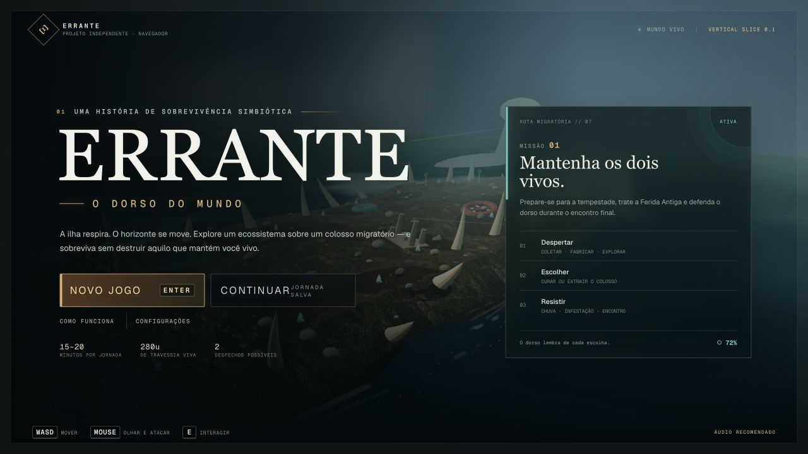
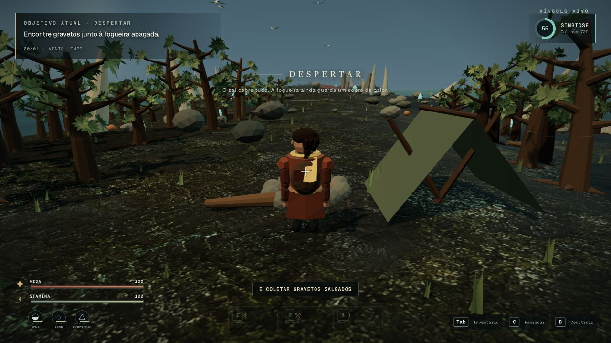
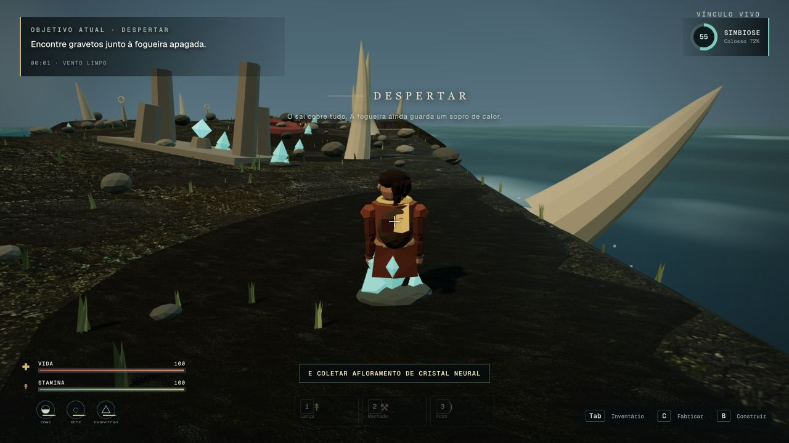

# ERRANTE: O Dorso do Mundo

> Um jogo 3D single-player de sobrevivência simbiótica, feito para navegador. Você não está sobre uma ilha: está sobre um colosso vivo atravessando um mundo inundado.

[▶ Rodar agora](#-rodar-agora) · [Entender a missão](#-a-missão) · [Ver controles](#-controles) · [Conhecer a arquitetura](#-arquitetura)



## ▶ Rodar agora

Requer **Node.js 22.13 ou superior**. Na raiz do projeto:

```bash
npm install
npm run jogar
```

Abra **http://localhost:3000**. O jogo foi projetado para desktop com teclado, mouse e áudio.

<details>
<summary>Comandos de desenvolvimento</summary>

```bash
npm run dev        # servidor local
npm run typecheck  # tipos
npm run lint       # qualidade de código
npm test           # testes + build + renderização
npm run build      # build de produção
npm run start      # executar o build
```

</details>

## 🎯 A missão

Seu objetivo é **manter o Errante e o colosso vivos até o encontro final**. A jornada dura aproximadamente 15–20 minutos e atravessa um dorso procedural de 280 unidades.

| Etapa | O que acontece | Decisão do jogador |
| --- | --- | --- |
| **1. Despertar** | O sobrevivente acorda perto de uma fogueira apagada. | Coletar madeira e fibras, fabricar uma lança e reconhecer o terreno. |
| **2. Preparação** | Fome, sede, exposição e clima começam a pressionar. | Construir abrigo, fogo, bancada e coletor sem sobrecarregar o dorso. |
| **3. Ferida Antiga** | Uma lesão neural revela cristais valiosos. | Curar o colosso ou extrair recursos e enfraquecer a simbiose. |
| **4. Migração** | Chuva e mergulho parcial alteram terreno, visão e sobrevivência. | Proteger recursos, procurar altura e reagir ao ambiente vivo. |
| **5. Infestação** | Parasitas atacam estruturas, personagem e criatura. | Defender o acampamento com armas, armadilhas e balista. |
| **6. Encontro** | Outro colosso surge além da névoa. | Chegar ao fim com saúde e vínculo suficientes para o melhor desfecho. |

### A regra central: simbiose

Tudo afeta a relação entre personagem e criatura. Curar feridas, evitar excesso de peso e defender o dorso melhora o vínculo. Extrair cristais, abandonar infestações ou explorar demais o organismo oferece vantagens imediatas, mas pode levar a um final mais duro.

O jogo possui **dois desfechos**, calculados pela saúde do colosso e pelo nível de simbiose.

## 📷 Gameplay

| Despertar e exploração | Recursos neurais coletáveis |
| --- | --- |
|  |  |

O cenário inclui bosque dorsal, pântano de musgo, Ferida Antiga, cavidade respiratória, ruína presa ao casco, cristas ósseas e oceano facetado em movimento.

## 🎮 Controles

| Ação | Controle |
| --- | --- |
| Movimento | `WASD` |
| Olhar | Mouse |
| Correr | `Shift` |
| Saltar | `Espaço` |
| Esquivar | `Q` |
| Interagir / coletar | `E` |
| Ataque leve | Clique esquerdo |
| Ataque carregado | Segurar clique esquerdo |
| Bloqueio / parry | Clique direito; o parry acontece nos primeiros 280 ms |
| Arremessar lança | `R` |
| Gancho em pontos ósseos | `G` |
| Trocar arma | `1`, `2`, `3` |
| Inventário | `Tab` ou `I` |
| Fabricação | `C` |
| Construção | `B` |
| Girar construção | `R` durante o posicionamento |
| Encaixe em grade | Segurar `Ctrl` durante o posicionamento |
| Desmontar estrutura próxima | `X` |
| Pausa | `Esc` |
| Desempenho e contato com o solo | `F3` |

### Atalhos de validação

Acrescente `?debug=1` à URL para habilitar ferramentas de QA:

- `P`: avança o evento atual.
- `V`: posiciona o jogador na condição de conclusão.
- `K`: força a condição de derrota.
- `O`: leva diretamente a um cristal neural coletável.
- `J`: percorre marcos e placas do terreno.
- `F`: vira o personagem para inspeção frontal.
- `F3`: mostra FPS, frame time, draw calls, triângulos, contato do piso, postura e posição.

## 🧭 Sistemas do jogo

- Exploração contínua sobre um colosso migratório.
- Personagem low-poly articulado, com juntas, pernas adaptativas e roupa segmentada.
- Solo caminhável contínuo com contato independente dos pés em terrenos inclinados.
- Árvores procedurais conectadas, raízes apoiadas e folhagem presa aos galhos.
- Oceano low-poly animado por shader, ondas cruzadas, espuma, spray e bruma.
- Coleta contextual, inventário, receitas e recursos neurais com consequências.
- Construção com preview, rotação, snap, peso dorsal, desmontagem e persistência.
- Vida, stamina, fome, sede, exposição e infecção.
- Quatro arquétipos de inimigos com percepção, perseguição, ataque e recuo.
- Combate corpo a corpo, ataques carregados, arremesso, bloqueio, parry e balista.
- Chuva migratória, mergulho parcial, infestação e encontro final.
- Autosave versionado, save manual e recuperação segura de dados inválidos.

## 🧱 Arquitetura

| Módulo | Responsabilidade |
| --- | --- |
| `app/game/data.ts` | Itens, receitas e estruturas. |
| `app/game/state.ts` | Inventário, crafting, sobrevivência, simbiose e cronologia. |
| `app/game/save.ts` | Validação, versionamento e preferências locais. |
| `app/game/map.ts` | Terreno, marcos, placas, cristais e âncoras espaciais. |
| `app/game/vegetation.ts` | Esqueletos conectados e determinísticos das árvores. |
| `app/game/world.ts` | Three.js, geração visual, oceano, personagens e recursos. |
| `app/game/ai.ts` | Estados e atributos dos inimigos. |
| `app/game/combat.ts` | Armas, dano, alcance e regras de ataque. |
| `app/game/events.ts` | Eventos, clima e apresentação da jornada. |
| `app/game/engine.ts` | Loop fixo, input, câmera, interação, combate e construção. |
| `app/game/audio.ts` | Ambiente, clima, passos, impactos e música adaptativa. |
| `app/game/GameApp.tsx` | Landing page, HUD, menus, configurações e fluxo de telas. |

A simulação usa timestep fixo de 60 Hz. O estado serializável permanece separado dos objetos Three.js, permitindo testar save, progressão e regras sem depender do renderer.

## ⚡ Performance

- Vegetação, pedras e estruturas repetidas usam instancing.
- Pool fixo de partículas evita alocações durante combate e clima.
- Presets Baixo, Médio e Alto controlam pixel ratio, sombras, vegetação e chuva.
- IA usa máquinas de estado e quantidade limitada de agentes simultâneos.
- Geometrias e materiais são compartilhados entre objetos repetidos.
- O overlay `F3` permite auditar FPS, frame time, draw calls e triângulos em tempo real.

## Limitações atuais

- Otimizado para teclado e mouse; gamepad e controles touch não fazem parte desta vertical slice.
- Props móveis não usam uma simulação rígida completa.
- A cavidade respiratória é uma experiência curta, não um dungeon interno completo.
- Áudio e música são sintetizados para manter o projeto autocontido.
- A configuração de qualidade é aplicada integralmente ao iniciar ou carregar uma jornada.

## Licenças e créditos

Consulte [CREDITS.md](./CREDITS.md). Nenhum asset externo de licença incerta é usado.
